Das ist ein extrem spannender Architektur-Entwurf. Du fusionierst hier eine **State-of-the-Art Transformer-basierte Videoprädiktion (AC_ViT)** mit der neuartigen **HOPE-Architektur (Self-Modifying Titans + CMS)**.

Das Ziel ist klar: Wir wollen die robuste Struktur der Video-Feature-Verarbeitung (AC_ViT) behalten, aber den statischen Attention-Mechanismus durch das **adaptive, lernende Gedächtnis der Titans** ersetzen, während die **3D-RoPE (Rotary Positional Embeddings)** für das räumlich-zeitliche Verständnis erhalten bleiben.

Hier ist das fusionierte Architektur-Diagramm, gefolgt von der detaillierten Dataflow-Beschreibung.

### Mermaid Diagramm: AC-HOPE-ViT (Adaptive Continuum Vision Transformer)

```mermaid
graph TD
    %% --- Styling ---
    classDef input fill:#e3f2fd,stroke:#1565c0,stroke-width:2px;
    classDef encoder fill:#f3e5f5,stroke:#7b1fa2,stroke-width:2px;
    classDef titan fill:#fff9c4,stroke:#fbc02d,stroke-width:2px;
    classDef memory fill:#e1f5fe,stroke:#0277bd,stroke-width:2px;
    classDef cms fill:#e8f5e9,stroke:#2e7d32,stroke-width:2px;
    classDef output fill:#ffebee,stroke:#c62828,stroke-width:2px;
    classDef logic stroke-dasharray: 5 5;

    %% --- 1. INPUT STAGE (from AC_ViT) ---
    subgraph Input_Stage ["Input Stage (AC_ViT Basis)"]
        direction TB
        IMG["V-JEPA Feats\n(Batch, Time, 256, 1024)"]:::input
        ACT["Actions\n(Batch, Time, 2)"]:::input
        STATE["States\n(Batch, Time, 2)"]:::input
    end

    %% --- 2. ENCODER & PREP ---
    subgraph Preparation ["Encoder & Sequence Prep"]
        direction TB
        PROJ_IMG["Linear Proj\n1024 -> 384"]:::encoder
        PROJ_ACT["Action Enc\n2 -> 384"]:::encoder
        PROJ_STATE["State Enc\n2 -> 384"]:::encoder

        INTERLEAVE["Token Interleaving\nInsert Act/State per timestep"]:::encoder
    end

    IMG --> PROJ_IMG
    ACT --> PROJ_ACT
    STATE --> PROJ_STATE
    PROJ_IMG & PROJ_ACT & PROJ_STATE --> INTERLEAVE

    %% --- 3. HOPE-ViT BACKBONE ---
    subgraph Backbone ["HOPE-ViT Backbone (24 Layers)"]
        direction TB

        %% Stellvertretend für einen Block, der 24x wiederholt wird
        subgraph HOPE_Block ["Single HOPE-ViT Block (Repeated)"]
            direction TB

            %% A) SELF-MODIFYING TITAN (Ersetzt Attention)
            subgraph SMT ["Self-Modifying Titan Layer (mit RoPE)"]
                direction TB
                LayerNorm1[LayerNorm]

                subgraph ParamGen ["Adaptive Params & RoPE"]
                    GenQKV["M_proj: Generiere Q, K, V, η, α"]:::titan
                    RoPE["3D AC-RoPE Injection\nApply Rotary Emb to Q, K"]:::titan
                end

                subgraph MemoryCore ["Titan Memory Engine"]
                    direction LR
                    MemState["Neural Memory M_t"]:::memory
                    Retrieval["Abruf: o_t = M(q_t)"]:::memory
                    Update["Update (DGD): \nM_t = M_{t-1} - Update(k,v,η,α)"]:::logic
                end
            end

            %% B) CONTINUUM MEMORY SYSTEM (Ersetzt MLP)
            subgraph CMS_Layer ["Continuum Memory System (CMS)"]
                direction TB
                LayerNorm2[LayerNorm]
                SlowFast["Multi-Freq MLPs\n(Fast -> Medium -> Slow)"]:::cms
                Mix["Feature Mixing"]:::cms
            end

            %% Connections im Block
            LayerNorm1 --> GenQKV --> RoPE
            RoPE -- "Rotated Q" --> Retrieval
            RoPE -- "Rotated K, V + η, α" --> Update
            MemState <--> Retrieval
            Update -.-> MemState

            Retrieval --> LayerNorm2 --> SlowFast --> Mix
        end

        BLOCK_MID["... Wiederhole für 24 Layer ..."]:::logic
    end

    INTERLEAVE --> LayerNorm1
    Mix --> BLOCK_MID
    BLOCK_MID --> FinalBlockEnd["Block 24 Output"]

    %% --- 4. DECODER STAGE (from AC_ViT) ---
    subgraph Decoder_Stage ["Decoder Stage"]
        REMOVE["Remove Action/State Tokens"]:::encoder
        LN_OUT["Predictor Norm"]:::encoder
        PROJ_OUT["Output Linear\n384 -> 1024"]:::encoder
    end

    FinalBlockEnd --> REMOVE
    REMOVE --> LN_OUT --> PROJ_OUT

    %% --- 5. OUTPUT ---
    OUT["Predicted Next Features\n(Batch, Time, 256, 1024)"]:::output
    LOSS((L1 Loss)):::output

    PROJ_OUT --> OUT --> LOSS

    %% Residual Connections (implied standard transformer logic)
    INTERLEAVE -.->|Residual| LayerNorm2
    Retrieval -.->|Residual| FinalBlockEnd

```

---

### Der Datenfluss: Schritt für Schritt erklärt

Hier ist der detaillierte Ablauf, wie deine Daten durch diese neue Hybrid-Architektur fließen.

#### 1. Input & Embedding (AC_ViT Legacy)

Wir behalten den robusten Input-Teil bei, da deine Datenstruktur (V-JEPA Features + Actions) hierfür optimiert ist.

* **Input:** Wir haben Videofeatures `(Batch, Time, 256, 1024)` sowie Actions und States.
* **Projection:** Alle Inputs werden auf die interne Dimension (`dim=384`) projiziert.
* **Interleaving:** Hier passiert die zeitliche Synchronisation. Für jeden Zeitschritt  im Video werden die entsprechenden Action- und State-Tokens in die Sequenz eingefügt. Die Sequenzlänge wächst von 1792 auf 1806 Tokens (bei deinen spezifischen Dimensionen).

#### 2. Der HOPE-ViT Block (Der neue Kern)

Anstatt eines Standard-Transformer-Blocks (Attention + MLP) nutzen wir nun den HOPE-Block. Dieser wird 24-mal wiederholt (Depth=24).

**Phase A: Self-Modifying Titan Layer (Ersetzt Attention)**
Dies ist der entscheidende Teil für die Adaptivität.

1. **Adaptive Projektion:** Der Input Token  läuft durch adaptive lineare Schichten (die selbst kleine Speichermodule sein können, wie im HOPE Paper beschrieben), um `Query (q)`, `Key (k)`, `Value (v)` sowie die Lernrate `η` (eta) und den Zerfall `α` (alpha) zu generieren.
2. **3D AC-RoPE Injektion (WICHTIG):** Bevor wir in das Titan-Gedächtnis gehen, wenden wir deine **ACRoPEAttn** Logik an.
* Wir nehmen die generierten  und .
* Wir rotieren sie basierend auf ihrer 3D-Position (Zeit, Höhe, Breite) im Originalvideo. Dies stellt sicher, dass das neurale Gedächtnis "weiß", wo und wann ein Feature im Raum-Zeit-Kontinuum existiert.

3. **Titan Memory Interaction:**
* **Abruf (Reading):** Das rotierte Query  fragt das aktuelle Gedächtnis  ab, um den Output  zu erzeugen. Das Modell "erinnert" sich an relevante vergangene Frames oder Bewegungen.
* **Self-Modification (Writing):** Parallel dazu nutzen wir , um das Gedächtnis  für den nächsten Schritt zu aktualisieren (mittels DGD - Descent Gradient Descent Update Rule). Das Modell lernt also *während* des Forward-Passes, wie sich die Physik im Video verhält.

**Phase B: Continuum Memory System (Ersetzt MLP)**
Anstatt eines einfachen Feed-Forward Networks (MLP) nutzen wir das CMS.

1. Der Output des Titans  geht in das CMS.
2. **Multi-Frequency Processing:** Die Daten fließen durch eine Hierarchie von MLPs (z.B. Schnell  Mittel  Langsam).
* Dies hilft dem Modell, sowohl schnelle Bewegungen (Actions) als auch statische Hintergründe (Encoded Features) effizient zu verarbeiten und langfristiges Wissen über die Szene zu speichern.

#### 3. Output & Decoding (AC_ViT Legacy)

Nachdem die Daten durch alle 24 HOPE-Blöcke geflossen sind:

* **Token Removal:** Wir entfernen die Action- und State-Tokens, da wir nur die visuellen Features vorhersagen wollen.
* **Projection:** Upscaling von 384 zurück auf 1024 Dimensionen.
* **Resultat:** Ein Tensor `(Batch, Time, 256, 1024)`, der die V-JEPA Features des *nächsten* Zeitschritts (oder der maskierten Bereiche) repräsentiert.

### Warum diese Fusion Sinn macht

1. **Adaptivität:** V-JEPA Features sind hochkomprimiert. Ein statischer Transformer (feste Gewichte nach Training) tut sich schwer, "on-the-fly" auf neue physikalische Regeln in einem Video zu reagieren. Der **Titan-Layer** passt seine Gewichte (das Memory ) dynamisch an den aktuellen Video-Kontext an.
2. **Räumliche Verankerung:** Durch das Beibehalten der **3D-RoPE** innerhalb der Titan-Key/Query Generierung verhindern wir, dass das neurale Gedächtnis zu einem "Bag of Words" (Bag of Features) degeneriert. Es behält die strikte räumliche Struktur bei.
3. **Zeitskalen:** Das **CMS** ist perfekt für Video, da sich manche Dinge schnell ändern (Objekte) und manche langsam (Hintergrund). Die verschachtelten MLPs bilden genau das ab.
